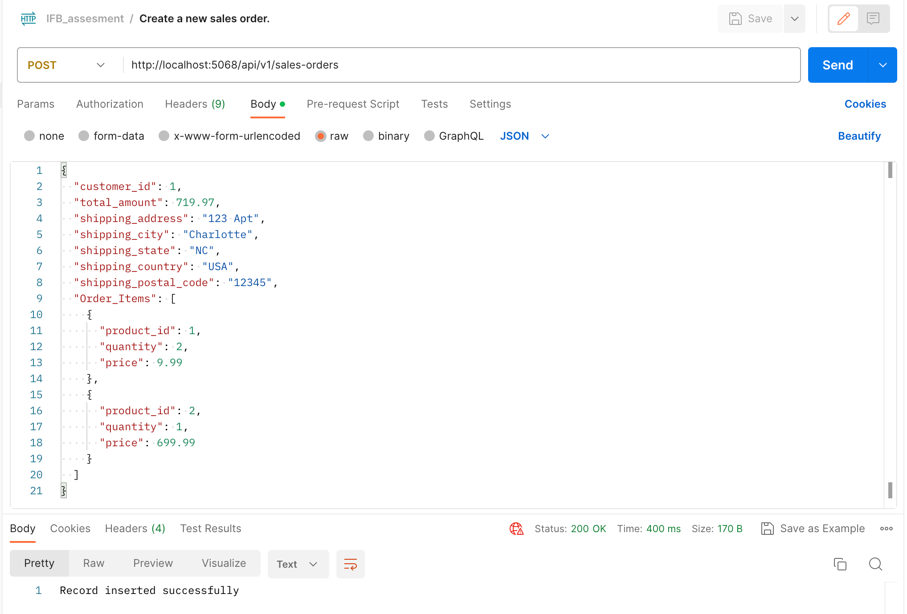

# Ecommerce API
[APIs Created for Assessment]

This project is an Ecommerce API that provides endpoints for managing customers, products, orders, and shipping information.

## Table of Contents
- [Installation](#installation)
- [Usage](#usage)
- [Endpoints](#endpoints)
- [Snapshots](#snapshots)

## Installation

To run this project locally, you need to have the following prerequisites installed:

- [.NET Core SDK](https://dotnet.microsoft.com/download) (version 6.0 or later)
- [MySQL](https://www.mysql.com/downloads/) database (To create tables and runnning the SQL server I use MySQL Workbench)

Follow these steps to set up the project:

1. Clone the repository:

   ```shell
   git clone https://github.com/anirudhgk/ecommerceAPI.git

2. Navigate to the project directory:

    ```shell
    cd ecommerceAPI

3. Install the dependencies and restore the packages needed:

    ```shell
    dotnet restore

4. Open MySQL workbench, connect and create a database (ex: ecommerce)

5. Run the SQL scripts, for ease of creating tables

6. Update the database connection string in the appsettings.json file to point to your MySQL database, be sure to check and give the credentials correctly.

7. Start the API server:

    ```shell
    dotnet run

The API server should now be running locally on http://localhost:5068

## Usage
Usage
You can use tools like [Postman](https://www.postman.com/downloads/) to interact with the API endpoints. The API supports the following operations:

- Create, read, update, and delete products
- Retrieve order details
- Create Sales Orders (post sales orders into the DB)
- Retrieve customer orders by customer ID
- Retrieve product information by product ID (get item info from DB based on ItemID)
- Get customer names who ordered a particular product to a particular city

## Endpoints
The API provides the following endpoints:

- **GET /api/v1/customers** : Get a list of all customers.
- **GET /api/v1/customer/{id}** : Get a customer by ID.
- **GET /api/v1/products** : Get a list of all products.
- **POST /api/v1/sales-orders** : Create a new sales order.
- **GET /api/v1/customer/{id}/orders** : Get customer orders by customer ID.
- **GET /api/v1/products/{product_id}** : Get product information by product ID.
- **POST /api/v1/products** : Create a new product.
- **PUT /api/v1/products/{product_id}** : Update an existing product.
- **DELETE /api/v1/products/{product_id}** : Delete a product.
- **GET /api/v1/customername?product_name={product_name}&city={city}** : Get customer names who ordered a particular product to a particular city.

### *Use the postman collection from the code to test the APIs.*

## Snapshots

1. 

2. 

3. 

4. 

5. 

6. 

7. 

8. 

9. 

10. 
